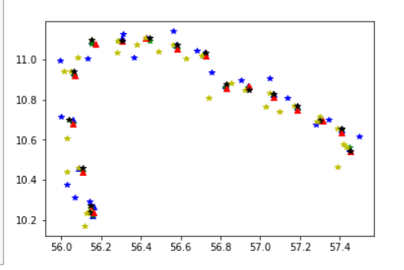

wrote an algorithm which simulates voyage journey from one journey as a reference this is very helpful if you are limited in datasets you can use this technique. The idea is to use a reference data and try to generate random datapoints across it and at the same time maintain sanity in the data like not having very random data use random functions but be very mindful about it

#The output will look something like

